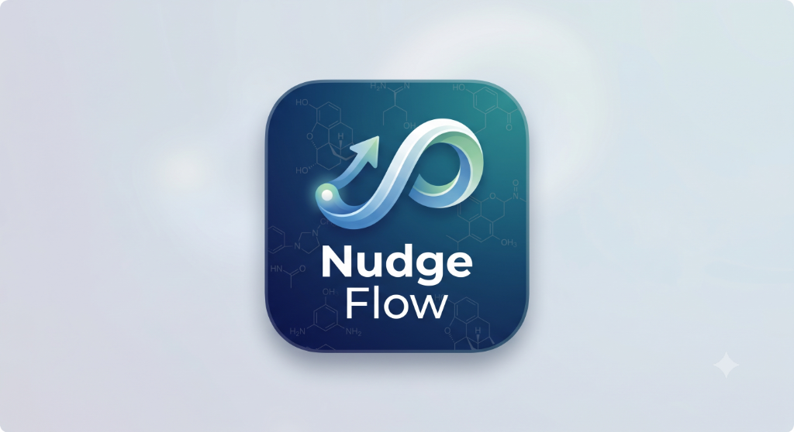

# NudgeFlow: Recovery & Prevention Platform

  

NudgeFlow is a multi-modal, GenAI-powered Progressive Web App (PWA) designed to support individuals navigating substance use disorders and their caregivers. Built specifically for moments of high cognitive load and distress, the platform provides immediate zero-typing interventions, personalized crisis de-escalation, and contextual safety tools.

## Key Features

- **Installable PWA (Add to Home Screen):** Quick one-tap access directly from your home screen. Bypasses the browser chrome and launches straight into the panic flow without requiring you to type a URL.
- **Zero-Friction SOS Interface:** A large, single-tap panic button serves as the immediate entry point for high-stress moments. No login walls, no complex menus, and absolutely zero typing required.
- **Actionable Web Push Notifications:** Receive and interact with alerts (e.g., "I'm okay" or "Get help now") directly from your device's notification center without needing to open the app.
- **Sobriety Tracker & Financial Calculator:** Stay motivated by tracking your exact clean days and hours. The tracker automatically calculates the money you've saved during your sobriety journey.
- **Simulated Craving Spike Flow:** Hit SOS to trigger a zero-typing sequence: an audio-guided breathing exercise followed by a personalized GenAI de-escalation script read aloud via Web Speech, alongside a one-tap button to alert your support contact.
- **Habit Builder:** Cultivate healthier routines. Replace addiction triggers with positive daily self-care and recovery habits, while tracking your success streaks.
- **Peer Support Community:** Connect anonymously with others in recovery. A supportive public forum mirroring the success of traditional 12-step peer communities.
- **India-Tailored Treatment Directory:** An accessible listing of local treatment providers, vetted non-profits, and national helplines (e.g., 14446 Tele-MANAS, NIMHANS, AIIMS NDDTC) so professional help is always at your fingertips.
- **Dedicated Caregiver View:** Caregivers receive instant Web Push alerts. Tapping the alert opens a tailored web view displaying an empathetic emergency script and a map of the nearest Naloxone/medical sites.

## Educational Resources

- **Clinical RAG-Grounded Q&A Chatbot:** An AI assistant sourced strictly from vetted clinical content. It utilizes adaptive reading levels and empathetic tones, but **never** generates free-form medical claims or dosages.
- **Caregiver-Specific Modules:** Targeted guidance for family members, including interactive scenarios like "What to expect in the first 90 days" and "How to set empathetic boundaries."
- **Myth vs. Fact Micro-Learning:** Plain-language explainers and interactive flipcards breaking down the science of addiction, including Medication-Assisted Treatment (MAT) and craving surfing.

## Safety, Ethics, & Compliance Guardrails

- **Human-in-the-Loop Escalation:** Crisis detection mechanisms always surface a human escalation path (e.g., 988 or 14446). The AI is strictly programmed never to attempt to "handle" a genuine emergency alone.
- **No AI Medical Prescriptions:** Zero AI-generated dosage, tapering, or drug-use instructions, regardless of the prompt framing.
- **Privacy by Design:** Architected with principles supporting 42 CFR Part 2 and HIPAA compliance. Features explicit consent flows and an anonymous/guest mode for prevention-side users.
- **Clinical Oversight:** All educational corpora are clinically reviewed before being indexed into the RAG system.
- **Stigma-Aware Language:** Non-judgmental, person-first language guidelines are rigidly enforced at the prompt-template level, ensuring the model's responses are always respectful and supportive.

---

*Mandatory Medical Disclaimer: Using apps for addiction recovery support can never replace treatment by a licensed mental healthcare provider. However, they can provide crucial social support between sessions and introduce you to a recovery community you might not have met otherwise.*